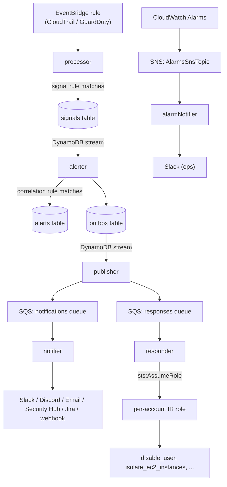

# Architecture

*How OpenCDR is put together: the Lambdas, the data stores, and the path an event takes from raw CloudTrail/GuardDuty record to delivered alert.*

## Design principles

- **Detection rules are versionable data, not code.** A rule is a JSON document stored in DynamoDB (`rule_kind`/`rule_id`/`rule_body`), editable at runtime via the API or in bulk via `scripts/load_rules.sh`. Nothing about adding or changing a rule requires a code deploy. See [Detection Rules](detection-rules.md).
- **Atomic detection is separate from windowed correlation.** `processor` matches one normalized event against one rule at a time and writes a **signal**. `alerter` looks at signals over a time window and writes an **alert** when a correlation rule's threshold is met. This mirrors how real correlation engines separate "did this one thing happen" from "did a pattern of things happen." See [Glossary](glossary.md#signal-vs-alert-vs-correlation).
- **Delivery uses the outbox pattern.** `alerter` doesn't call SQS directly — it writes a row to an outbox table in the same logical operation as writing the alert, and a separate `publisher` Lambda (triggered by the outbox table's own DynamoDB stream) claims and publishes that row to SQS. This gives at-least-once delivery without alerter and publisher being directly coupled, and survives a `publisher` failure without losing the alert (the outbox row just stays `PENDING` and gets retried, up to `PUBLISHER_MAX_ATTEMPTS`).
- **`processor`'s EventBridge rule is single-region by default.** CloudTrail delivers an event to the default bus in whichever region the API call happened in — true even for a multi-region trail — and GuardDuty detectors are per-region. An account operating in more than one region needs an explicit, opt-in step per additional region to not be blind everywhere except the deployment region. See [Cross-Region Event Forwarding](region-forwarding.md).

## The seven Lambda functions

| Function | Trigger | Responsibility |
|---|---|---|
| `processor` | EventBridge rule (CloudTrail/GuardDuty) | Normalize the raw event, run signal detection rules against it, write matching signals |
| `alerter` | DynamoDB stream on the signals table | Run correlation rules over recent signals, write alerts + an outbox record |
| `publisher` | DynamoDB stream on the outbox table | Claim outbox records, publish to the notifications/responses SQS queues |
| `notifier` | SQS (notifications queue) | Format and deliver an alert to whichever channels are configured (Slack/Discord/Email/Security Hub/Jira/webhook) |
| `responder` | SQS (responses queue) | Execute an automated IR response module, assuming a per-account IAM role first |
| `api` | API Gateway (HTTP, API-key auth) | Query signals/logs/rules, manage settings and IR-role mappings |
| `alarmNotifier` | SNS (`AlarmsSnsTopic`) | Format a CloudWatch Alarm state-change notification and forward it to Slack — operational/infra health, separate from the security-alert pipeline above |

Each function has its **own** IAM role (`serverless-iam-roles-per-function`), not one shared role for the whole stack — `processor` can't call SQS, `notifier` can't touch DynamoDB streams it doesn't own, and only `responder` can call `sts:AssumeRole`, and only on roles matching one naming convention. See [Security](security.md).

## Data flow

Both queues have their own dead-letter queue, and both DynamoDB-stream-triggered Lambdas (`alerter`, `publisher`) feed a shared `stream-failures` queue for records that fail stream processing outright — see [Observability](observability.md) for how depth on any of these three queues surfaces as an alarm.

## DynamoDB tables

All tables are pay-per-request (no capacity to plan for). Naming convention: `${service}-${stage}-<name>-table`.

| Table | Partition key | Sort key | GSIs | Written by | Read by |
|---|---|---|---|---|---|
| `signals-table` | `severity` | `timestamp` | `gsi_signal_event_id` (event_id/timestamp), `gsi_signal_category_id` (category/timestamp), `gsi_signal_actor_user_name` (actor.user_name/timestamp — what correlation rules query) | `processor` | `alerter`, `api` |
| `alerts-table` | `alert_key` | `timestamp` | — | `alerter` | `api` |
| `outbox-table` | `outbox_id` | — | — (own DynamoDB stream is the trigger) | `alerter` | `publisher` |
| `logs-table` | `service` | `timestamp` | `gsi_logs_event_id` (event_id/timestamp), `gsi_activity_name` (event_name/timestamp) | every Lambda, via the shared `Logger` | `api` |
| `detection-rules-table` | `rule_kind` | `rule_id` | — | `scripts/load_rules.sh`, `POST/PUT /rules` | `processor`, `alerter`, `api` |
| `settings-table` | `setting_id` | — | — | `POST/PUT /settings` | `notifier`, `api` |
| `ir-account-roles-table` | `aws_account_id` | — | — | `POST/PUT /ir-roles` | `responder` |

`logs-table` is OpenCDR's own structured operational log — every handler's `Logger` writes here in addition to stdout/CloudWatch Logs, queryable via `GET /logs`. This is a different thing from the CloudWatch-native observability layer (metrics, traces, alarms) — see [Observability](observability.md) for that.

## SQS queues

| Queue | Purpose | DLQ |
|---|---|---|
| `notifications-queue` | Alerts destined for `notifier` | `notifications-dlq` |
| `responses-queue` | Alerts destined for `responder` (only when the matched rule has a `response_module`) | `responses-dlq` |
| `stream-failures` | Poison-pill records from the signals/outbox DynamoDB streams that `alerter`/`publisher` couldn't process | — (it's already the dead-letter path) |

## Related pages

- [Detection Rules](detection-rules.md) — the rule schema `processor`/`alerter` evaluate
- [Notifications](notifications.md) — how `notifier` picks and formats a channel
- [Incident Response](incident-response.md) — how `responder` decides what to do and with which credentials
- [API Reference](api-reference.md) — the `api` Lambda's routes
- [Observability](observability.md) — traces, metrics, dashboard, and alarm delivery for this whole pipeline
- [Cross-Region Event Forwarding](region-forwarding.md) — closing the single-region blind spot for multi-region accounts
