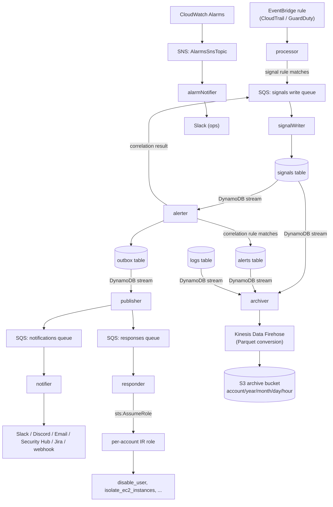

# Architecture

*How OpenCDR is put together: the Lambdas, the data stores, and the path an event takes from raw CloudTrail/GuardDuty record to delivered alert.*

## Design principles

- **Detection rules are versionable data, not code.** A rule is a JSON document stored in DynamoDB (`rule_kind`/`rule_id`/`rule_body`), editable at runtime via the API or in bulk via `scripts/load_rules.sh`. Nothing about adding or changing a rule requires a code deploy. See [Detection Rules](detection-rules.md).
- **Atomic detection is separate from windowed correlation.** `processor` matches one normalized event against one rule at a time and writes a **signal**. `alerter` looks at signals over a time window and writes an **alert** when a correlation rule's threshold is met. This mirrors how real correlation engines separate "did this one thing happen" from "did a pattern of things happen." See [Glossary](glossary.md#signal-vs-alert-vs-correlation).
- **Delivery uses the outbox pattern.** `alerter` doesn't call SQS directly — it writes a row to an outbox table in the same logical operation as writing the alert, and a separate `publisher` Lambda (triggered by the outbox table's own DynamoDB stream) claims and publishes that row to SQS. This gives at-least-once delivery without alerter and publisher being directly coupled, and survives a `publisher` failure without losing the alert (the outbox row just stays `PENDING` and gets retried, up to `PUBLISHER_MAX_ATTEMPTS`).
- **`processor`'s EventBridge rule is single-region by default.** CloudTrail delivers an event to the default bus in whichever region the API call happened in — true even for a multi-region trail — and GuardDuty detectors are per-region. An account operating in more than one region needs an explicit, opt-in step per additional region to not be blind everywhere except the deployment region. See [Cross-Region Event Forwarding](region-forwarding.md).

## The nine Lambda functions

| Function | Trigger | Responsibility |
|---|---|---|
| `processor` | EventBridge rule (CloudTrail/GuardDuty) | Normalize the raw event, run signal detection rules against it, enqueue matching signals to `signalWriter` |
| `signalWriter` | SQS (signals write queue) | Perform the actual signals-table-v2 write `processor`/`alerter` enqueue to — decouples bursty writes from the table's day-bucketed partition key, see below |
| `alerter` | DynamoDB stream on the signals table | Run correlation rules over recent signals, write alerts + an outbox record, enqueue the correlation result as a signal (via `signalWriter`) |
| `publisher` | DynamoDB stream on the outbox table | Claim outbox records, publish to the notifications/responses SQS queues |
| `notifier` | SQS (notifications queue) | Format and deliver an alert to whichever channels are configured (Slack/Discord/Email/Security Hub/Jira/webhook) |
| `responder` | SQS (responses queue) | Execute an automated IR response module, assuming a per-account IAM role first |
| `api` | API Gateway (HTTP, API-key auth) | Query signals/logs/rules, manage settings and IR-role mappings |
| `alarmNotifier` | SNS (`AlarmsSnsTopic`) | Format a CloudWatch Alarm state-change notification and forward it to Slack — operational/infra health, separate from the security-alert pipeline above |
| `archiver` | DynamoDB streams on the signals/alerts/logs tables | Flatten and forward new records to S3 (Parquet, via Firehose) before they TTL out of DynamoDB — see [`data-archival.md`](data-archival.md) |

Each function has its **own** IAM role (`provider.iam.role.mode: perFunction`), not one shared role for the whole stack — `processor` can't touch DynamoDB streams, `notifier` can't touch DynamoDB streams it doesn't own, and only `responder` can call `sts:AssumeRole`, and only on roles matching one naming convention. See [Security](security.md).

## Data flow



Every SQS queue above (`signals-write-queue`, `notifications-queue`, `responses-queue`) has its own dead-letter queue, and every DynamoDB-stream-triggered Lambda (`alerter`, `publisher`, `archiver`) feeds a shared `stream-failures` queue for records that fail stream processing outright — see [Observability](observability.md) for how depth on any of these queues surfaces as an alarm.

## DynamoDB tables

All tables are pay-per-request (no capacity to plan for). Naming convention: `${service}-${stage}-<name>-table`. `signals-table-v2`, `alerts-table`, `outbox-table`, and `logs-table-v2` all TTL at `DYNAMODB_TTL_DAYS` (default 90) — signals/alerts/logs are archived to S3 first (see [`data-archival.md`](data-archival.md)), so nothing is actually lost when they expire here.

`signals-table-v2`/`logs-table-v2` use a day-bucketed composite HASH key (`severity_bucket`/`service_bucket`, `"HIGH#2026-08-12"`, computed by `src/infra/partition_keys.py`) rather than a bare `severity`/`service` value — a single low-cardinality value (6 severities, 8 services) meant every write for that value shared one DynamoDB partition, with a real throughput ceiling independent of pay-per-request billing. The composite key self-scales with no per-deployment tuning. `severity`/`service` themselves are untouched on every item — `archiver`'s `flatten_signal`/`flatten_log` and the S3/Parquet archive still see clean values (see [`data-archival.md`](data-archival.md)). "V2" is a naming leftover from the migration itself (the original bare-key tables were deployed alongside these during cutover, then decommissioned) — not a sign a further migration is pending.

| Table | Partition key | Sort key | GSIs | Written by | Read by |
|---|---|---|---|---|---|
| `signals-table-v2` | `severity_bucket` | `timestamp` | `gsi_signal_event_id` (event_id/timestamp), `gsi_signal_category_id` (category/timestamp), `gsi_signal_actor_user_name` (actor.user_name/timestamp — what correlation rules query) | `signalWriter` | `alerter`, `api`, `archiver` |
| `alerts-table` | `alert_key` | `timestamp` | — | `alerter` | `api`, `archiver` |
| `outbox-table` | `outbox_id` | — | — (own DynamoDB stream is the trigger) | `alerter` | `publisher` |
| `logs-table-v2` | `service_bucket` | `timestamp` | `gsi_logs_event_id` (event_id/timestamp), `gsi_activity_name` (event_name/timestamp) | every Lambda, via the shared `Logger` | `api`, `archiver`, `responder` (rate-limit circuit breaker) |
| `detection-rules-table` | `rule_kind` | `rule_id` | — | `scripts/load_rules.sh`, `POST/PUT /rules` | `processor`, `alerter`, `api` |
| `settings-table` | `setting_id` | — | — | `POST/PUT /settings` | `notifier`, `api` |
| `ir-account-roles-table` | `aws_account_id` | — | — | `POST/PUT /ir-roles` | `responder` |

`logs-table-v2` is OpenCDR's own structured operational log — every handler's `Logger` writes here in addition to stdout/CloudWatch Logs, queryable via `GET /logs`. This is a different thing from the CloudWatch-native observability layer (metrics, traces, alarms) — see [Observability](observability.md) for that.

**If you're building custom tooling directly against these tables** (bypassing the API): always Query via one of the GSIs above, never Scan. The `api` Lambda's own read paths already only Query, on purpose — a Scan on `signals-table-v2` or `logs-table-v2` reads the entire table regardless of how selective your filter is, and gets more expensive every day these tables accumulate data (which is exactly what TTL/archival above is trying to keep in check on the write side; a Scan habit undoes that on the read side).

## SQS queues

| Queue | Purpose | DLQ |
|---|---|---|
| `signals-write-queue` | Signal writes `processor`/`alerter` enqueue instead of writing directly, destined for `signalWriter` | `signals-write-dlq` |
| `notifications-queue` | Alerts destined for `notifier` | `notifications-dlq` |
| `responses-queue` | Alerts destined for `responder` (only when the matched rule has a `response_module`) | `responses-dlq` |
| `stream-failures` | Poison-pill records from the signals/alerts/outbox/logs DynamoDB streams that `alerter`/`publisher`/`archiver` couldn't process | — (it's already the dead-letter path) |

## Repository layout

```
src/
  domain/               # Cloud-agnostic detection & correlation logic
  handlers/             # Lambda entry points (processor, alerter, publisher, notifier, responder, api, alarm_notifier)
  infra/                # AWS adapters (DynamoDB, SQS, logging, metrics, X-Ray)
  config/               # Env/config loading shared across handlers
  notifier/             # Shared HTTP transport used by notification delivery
docs/                   # This documentation set
support_files/
  detection_rules/      # Production rules (load with scripts/load_rules.sh), one folder per event source
    cloudtrail/          # CloudTrail-sourced signal + correlation rules
    guardduty/           # GuardDuty-sourced signal rules
    correlation/          # Correlation rules spanning more than one source
  test_events/          # Sample EventBridge events for local rule testing
  settings/             # Example notification settings
scripts/
  opencdr.py            # Management CLI (setup wizard, rules, settings, signals, logs)
  test_rules_local.py   # Test rules locally without AWS
  load_rules.sh         # Seed rules into DynamoDB
  test_deployed.sh      # Integration test against deployed stack
  cost_report.sh        # Query Cost Explorer spend for a stage
  setup_region_forwarding.sh  # Onboard additional AWS regions (see region-forwarding.md)
mcp_server/
  server.py              # MCP server -- default management plane (rules, lists, signals, logs, settings, ir-roles); see api-reference.md#mcp-server-default-management-plane
tests/
  domain/               # Unit tests for detection, correlation, and parser
  handlers/             # Unit tests for Lambda handlers (notifier channels, etc.)
  infra/                # Unit tests for AWS adapter layer
  scripts/              # Unit tests for the CLI
ci-bootstrap/           # Standalone CFN template for the OIDC deploy role (see deployment.md)
region-forwarding/      # Standalone CFN template for cross-region event forwarding (see region-forwarding.md)
serverless.yml          # Infrastructure definition
openapi.yml             # API spec (see api-reference.md for known drift)
```

`dredge` (the incident response action library `responder` runs actions through) is a separate, pinned dependency (`requirements.txt`), not vendored into this repo — see [Incident Response](incident-response.md).

## Related pages

- [Detection Rules](detection-rules.md) — the rule schema `processor`/`alerter` evaluate
- [Notifications](notifications.md) — how `notifier` picks and formats a channel
- [Incident Response](incident-response.md) — how `responder` decides what to do and with which credentials
- [API Reference](api-reference.md) — the `api` Lambda's routes
- [Observability](observability.md) — traces, metrics, dashboard, and alarm delivery for this whole pipeline
- [Cross-Region Event Forwarding](region-forwarding.md) — closing the single-region blind spot for multi-region accounts
